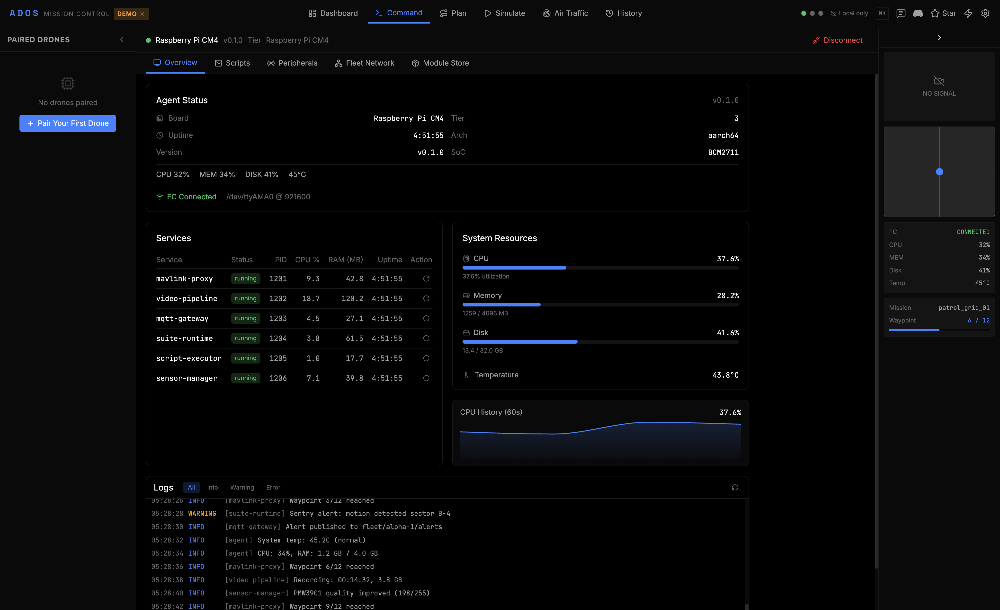
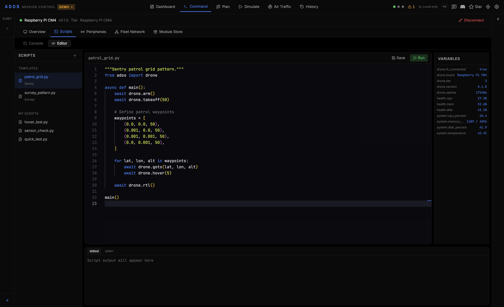
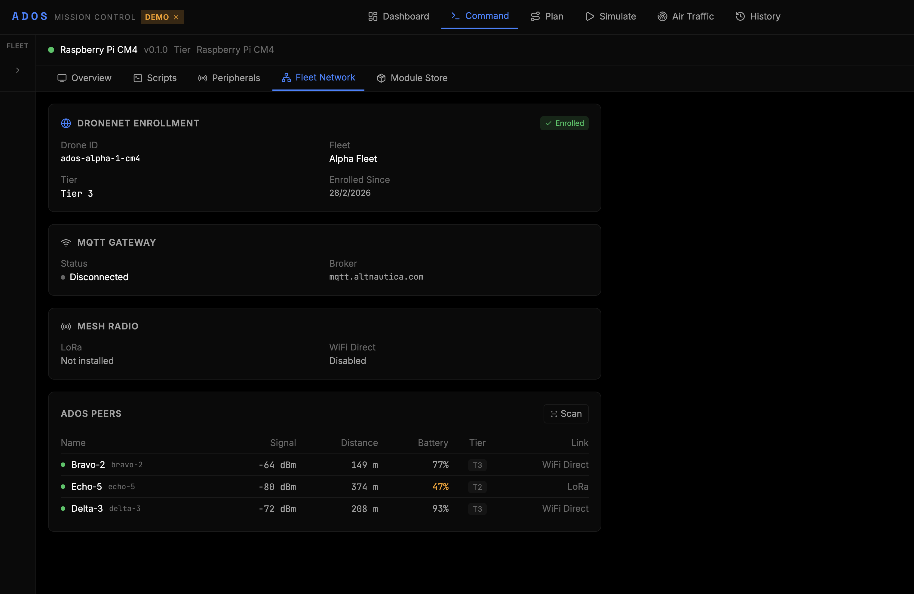

# ADOS Drone Agent

**Open-source onboard agent for software-defined drones. 50km data link. HD video. Full remote control.**

   [](https://discord.gg/uxbvuD4d5q)

ADOS Drone Agent is the onboard intelligence layer for software-defined drones. It runs on your companion computer, proxies MAVLink from the flight controller to WebSocket and TCP, handles the 50km data link, streams HD video, and gives you full remote control from ADOS Mission Control or any HTTP client.

> **Part of the ADOS ecosystem.** Pairs with [ADOS Mission Control](https://github.com/altnautica/ADOSMissionControl) (the browser GCS) for AI PID tuning, mission planning, 3D simulation, live ADS-B, and gamepad flight control at 50Hz. The agent runs on the drone; Mission Control runs in your browser.

<p align="center">
  <strong><a href="https://github.com/altnautica/ADOSMissionControl">ADOS Mission Control</a></strong> |
  <strong><a href="https://docs.altnautica.com">Docs</a></strong> |
  <strong><a href="https://altnautica.com">Website</a></strong> |
  <strong><a href="https://discord.gg/uxbvuD4d5q">Discord</a></strong> |
  <strong><a href="mailto:team@altnautica.com">Email</a></strong> |
  <strong><a href="https://github.com/altnautica/ADOSDroneAgent/issues">Issues</a></strong>
</p>

---

<table>
  <tr>
    <td width="50%">
      <br>
      <sub>Overview tab, showing running services, system resources, and live logs (<code>ados tui</code>)</sub>
    </td>
    <td width="50%">
      <br>
      <sub>Script editor with syntax highlighting for Python drone automation</sub>
    </td>
  </tr>
  <tr>
    <td width="50%">
      <br>
      <sub>Fleet network enrollment, MQTT gateway status, and mesh radio peers</sub>
    </td>
    <td width="50%">
      <br>
      <sub>Application suites: Sentry, Survey, Inspection, Agriculture, Cargo, and SAR</sub>
    </td>
  </tr>
</table>

<p align="center">
  <br>
  <sub>Connected peripherals with live sensor readings</sub>
</p>

---

## Quick Start

```bash
git clone https://github.com/altnautica/ADOSDroneAgent.git
cd ADOSDroneAgent
pip install -e ".[dev]"
ados demo    # simulated drone telemetry, no hardware needed
```

Deploy to a companion computer (Raspberry Pi, Jetson, etc.):

```bash
curl -sSL https://raw.githubusercontent.com/altnautica/ADOSDroneAgent/main/scripts/install.sh | bash
```

The script detects your OS, installs Python 3.11, auto-detects the FC serial port, and configures systemd services.

### System Requirements

| Requirement | Minimum | Recommended |
|-------------|---------|-------------|
| Python | 3.11+ | 3.12 |
| OS | Any Linux with systemd | Raspberry Pi OS, Ubuntu, Debian |
| RAM | 64MB (Tier 1 basic) | 512MB+ (Tier 2+) |
| Storage | 100MB | 500MB |
| FC connection | Serial (UART or USB) | UART at 921600 baud |

Also runs on macOS for local development and testing.

## What It Does

**MAVLink proxy.** Reads the FC serial port and routes MAVLink to WebSocket, TCP, and UDP simultaneously. Multiple ground stations can connect at once. Auto-reconnect on FC disconnect.

**50km data link.** When paired with ADOS Mission Control, the agent publishes telemetry via MQTT over a Cloudflare Tunnel at 2Hz+. No port forwarding needed. Works from anywhere with a cellular connection.

**HD video streaming.** The video pipeline supports RTSP, WebRTC/WHEP, and WFB-ng radio paths. Mission Control can play live feeds in the browser over local or relayed connections.

**Full remote control.** The GCS can send arm/disarm, mode changes, guided flight commands, and mission uploads through the cloud relay. The agent polls and executes them. All from a browser, over any network.

**REST API.** FastAPI server at `:8080` with 16 route modules. Get telemetry, set FC parameters, send commands, manage config, control video, manage suites, run scripts. Full OpenAPI docs at `/docs`.

**MAVLink signing.** The agent is a transparent pipe for MAVLink v2 signed frames. `/api/mavlink/signing/*` exposes capability detection and one-shot FC enrollment via `SETUP_SIGNING`. Keys live in the GCS browser; the agent holds no key material. See [docs](https://docs.altnautica.com/drone-agent/mavlink-signing).

**Terminal dashboard.** Five-screen TUI via `ados tui`: overview, telemetry, MAVLink inspector, logs, config editor. SSH-friendly for headless hardware.

**Hardware auto-detection.** Detects board tier on boot (RPi Zero 2W through CM5 / Jetson) and enables services based on available resources.

**Ground station mode.** The same agent codebase runs on a ground SBC. A hardware fingerprint at boot picks the `ground_station` profile (OLED on I2C plus four GPIO buttons plus an RTL8812EU adapter, no flight controller) versus the drone profile. Within the ground-station profile the node runs in one of three deployment roles described below.

**Distributed receive and local mesh.** Two or three Ground Agents can be deployed together for obstructed flight areas. A `receiver` node hubs the deployment; one or more `relay` nodes forward WFB-ng fragments to the receiver over a self-healing batman-adv mesh on a second USB WiFi dongle. The receiver runs WFB-ng's native FEC combine across the merged stream. Pairing is field-only via the OLED in 60 seconds, no laptop required. See `docs.altnautica.com/ground-agent/mesh-overview` for the full picture.

---

## Hardware Support

| Tier | Hardware | RAM | Capabilities |
|------|----------|-----|-------------|
| Tier 1 (Basic) | RPi Zero 2W | 128MB+ | MAVLink proxy, MQTT gateway |
| Tier 2 (Smart) | RPi 4 / CM4 | 512MB+ | + Python scripting, sensor monitoring |
| Tier 3 (Autonomous) | CM5 / Jetson Nano | 2GB+ | + Suite runtime, vision, SLAM |
| Tier 4 (Swarm) | CM5 + radios | 2.5GB+ | + Mesh networking, formation flight |

Any Linux ARM64 or x86_64 board with a serial port should work. The tier system scales features to available resources automatically.

**Mesh role hardware.** A single ground node (`direct` role) needs one RTL8812EU USB WiFi adapter for WFB-ng. Relay and receiver nodes add a second USB WiFi dongle that carries batman-adv mesh traffic between nodes. Any adapter with a Linux driver that supports 802.11s or IBSS mode works for the mesh carrier.

---

## CLI Reference

34 commands. Run `ados --help` for the full list.

| Command | Description |
|---------|-------------|
| `ados start` | Connect to FC and start all services |
| `ados demo` | Start with simulated telemetry (no hardware needed) |
| `ados tui` | Launch the terminal dashboard |
| `ados status` | FC connection and agent status |
| `ados health` | CPU, RAM, disk, temperature |
| `ados config` | Print current config |
| `ados config <key>` | Print one config value by dot path |
| `ados set <key> <val>` | Update a config value |
| `ados mavlink` | MAVLink proxy status and connected clients |
| `ados video` | Video pipeline status |
| `ados link` | Cloud connectivity status |
| `ados scripts` | List available automation scripts |
| `ados run <path>` | Execute a Python automation script |
| `ados send <command>` | Send a command to the FC (arm, disarm, mode) |
| `ados snap` | Take a camera snapshot |
| `ados pair` | Pair with ADOS Mission Control |
| `ados unpair` | Remove GCS pairing |
| `ados update` | Check for agent updates |
| `ados upgrade` | Upgrade to latest version |
| `ados rollback [version]` | Rollback to a previous version |
| `ados check` | Run pre-flight diagnostics |
| `ados uninstall` | Remove the agent |
| `ados version` | Print agent version |
| `ados ros status` | ROS 2 environment status |
| `ados ros init` | Initialize Docker-based ROS 2 environment |
| `ados ros create-node <name>` | Scaffold a new ROS 2 Python package |
| `ados ros build` | Trigger colcon build in the container |
| `ados ros shell` | Open an interactive shell in the ROS container |

### Ground station (`ados gs`)

Available when the node is running in ground-station profile. Hidden on drone-profile installs.

| Command | Description |
|---------|-------------|
| `ados gs status` | Profile, role, WFB-ng link, uplink priority |
| `ados gs wfb pair <key>` | Pair this ground node with a drone |
| `ados gs wfb unpair` | Remove the installed drone pair key |
| `ados gs network show` | Active uplinks and their priorities |
| `ados gs network ap` | WiFi AP state and client list |
| `ados gs network client scan` | Scan for joinable WiFi networks |
| `ados gs network client join <ssid>` | Join an existing WiFi network for uplink |
| `ados gs network modem status` | 4G modem signal, APN, data cap usage |
| `ados gs role show` | Current deployment role (`direct`, `relay`, or `receiver`) |
| `ados gs role set <role>` | Switch role. Agent restarts mesh and WFB-ng services |
| `ados gs mesh health` | batman-adv carrier, mesh ID, gateway mode |
| `ados gs mesh neighbors` | Neighbor MACs, TQ, last-seen |
| `ados gs mesh gateways` | Advertised gateways and selected route |
| `ados gs mesh accept <window_s>` | Open a pairing accept window on the receiver |
| `ados gs mesh pending` | Relays waiting for approval |
| `ados gs mesh approve <device_id>` | Admit a pending relay into the mesh |
| `ados gs mesh revoke <device_id>` | Remove an approved relay |
| `ados gs mesh join --receiver-host <host>` | On a relay, join a receiver during its accept window |

---

## REST API

FastAPI server at `:8080`. Full OpenAPI docs at `/docs`. 16 route modules.

| Endpoint | Method | Description |
|----------|--------|-------------|
| `/api/status` | GET | Agent status, uptime, FC state |
| `/api/telemetry` | GET | Attitude, GPS, battery snapshot |
| `/api/params` | GET / PUT | Read or set FC parameters |
| `/api/commands` | POST | Send MAVLink command to FC |
| `/api/config` | GET / PUT | Read or update agent config |
| `/api/logs` | GET | Recent log entries |
| `/api/services` | GET | Running services and status |
| `/api/video` | GET / POST | Video pipeline status and control |
| `/api/scripts` | GET / POST | List and execute automation scripts |
| `/api/suites` | GET / PUT | Suite activation and status |
| `/api/fleet` | GET / POST | Fleet enrollment and network status |
| `/api/peripherals` | GET | Connected sensors and hardware |
| `/api/pairing` | GET / POST / DELETE | GCS pairing management |
| `/api/system` | GET / POST | System info, reboot, shutdown |
| `/api/ota` | GET / POST | Update check, upgrade, rollback |
| `/api/ros/status` | GET | ROS 2 environment state and container info |
| `/api/ros/init` | POST | Initialize ROS environment (SSE progress stream) |
| `/api/ros/nodes` | GET | Running ROS 2 nodes with publisher/subscriber info |
| `/api/ros/topics` | GET | Active topics with types and rates |
| `/api/ros/workspace` | GET | Workspace packages and build status |
| `/api/ros/recordings` | GET | MCAP recording files with metadata |
| `/api/ground_station/*` | GET / PUT / POST / DELETE | Ground-station profile only. Role, mesh, pairing, WFB-ng relay/receiver, uplinks, physical UI |

```bash
# Get current telemetry
curl http://localhost:8080/api/telemetry

# Arm the drone
curl -X POST http://localhost:8080/api/commands \
  -H "Content-Type: application/json" \
  -d '{"command": "arm"}'
```

---

## Cloud Connectivity

The agent connects to ADOS Mission Control over a three-layer relay.

**Convex HTTP (baseline).** Every 5 seconds, the agent POSTs full status to the cloud. The GCS reads via reactive Convex queries. Commands go the reverse direction. Zero extra infra required.

**MQTT telemetry (real-time).** When `server.mode` is `cloud` or `self_hosted`, the agent publishes to `ados/{deviceId}/status` and `ados/{deviceId}/telemetry` via Mosquitto over WebSocket. The GCS subscribes in-browser via mqtt.js. 2Hz+ update rate.

**RTSP video.** The video pipeline pushes to a cloud relay, which converts it to fMP4-over-WebSocket for browser playback at 0.5-1.5s latency.

| Config field | Default | Description |
|---|---|---|
| `server.mode` | `disabled` | `disabled`, `cloud`, or `self_hosted` |
| `server.mqtt_transport` | `tcp` | `tcp` or `websockets` |
| `server.mqtt_username` | — | MQTT broker username |
| `video.cloud_relay_url` | — | RTSP relay server URL |

---

## ROS 2 Integration

Opt-in ROS 2 Jazzy environment running inside a Docker container alongside the agent. Designed for researchers, commercial integrators, and developers who want to connect the drone to the wider robotics ecosystem without affecting users who don't need ROS.

**How it works.** A single `ados ros init` command pulls the Docker image, starts the container, and launches the MAVLink bridge node. The bridge reads the agent's IPC socket and publishes 11 mavros-compatible ROS 2 topics (IMU, GPS, battery, state, rangefinder, and more). Foxglove Studio connects to port 8766 for real-time visualization.

**Three access tiers.** LAN Direct (ws://drone:8766, no cloud dependency), Altnautica Cloud Relay (wss://ros-*.altnautica.com via Cloudflare Tunnel), or Self-Hosted (Tailscale, ZeroTier, WireGuard, or your own tunnel).

**Developer workspace.** Write ROS 2 nodes in Python or C++, auto-build on save, scaffold from templates (`ados ros create-node my_planner --template planner`). MCAP recording with automatic rotation policy.

**Profiles.** Minimal (bridge + Foxglove only, ~340 MB RAM), VIO (+ camera + VINS-Fusion, ~900 MB), Mapping (+ octomap, ~900 MB).

| Config | Default | Description |
|---|---|---|
| `ros.enabled` | `false` | Enable ROS 2 integration |
| `ros.middleware` | `zenoh` | `zenoh` (NAT-friendly) or `cyclonedds` (LAN, lower latency) |
| `ros.profile` | `minimal` | `minimal`, `vio`, `mapping`, or `custom` |
| `ros.foxglove_port` | `8766` | Foxglove bridge WebSocket port |

---

## Architecture

```
┌──────────┐  ┌──────────┐
│   CLI    │  │   TUI    │   User interfaces
└────┬─────┘  └────┬─────┘
     │              │
     ▼              ▼
┌──────────────────────────┐
│       REST API           │   FastAPI :8080 (16 route modules)
└────────────┬─────────────┘
             │
             ▼
┌──────────────────────────┐
│       AgentApp           │   Core process manager
└──┬───────┬───────┬───────┘
   │       │       │
   ▼       ▼       ▼
┌──────┐ ┌──────┐ ┌──────┐   ┌─────────────────────┐
│ MAV  │ │ MQTT │ │Video │   │  ROS 2 Container    │  Optional (Docker)
│Proxy │ │ GW   │ │Pipe  │   │  MAVLink bridge     │
└──────┘ └──────┘ └──────┘   │  Foxglove bridge    │
   │                          │  User nodes         │
   ▼                          └─────────┬───────────┘
┌──────────┐                            │
│   FC     │   Flight controller        │  /run/ados/mavlink.sock
└──────────┘   (serial/USB)             │  (IPC bind mount)
   ▲                                    │
   └────────────────────────────────────┘
```

---

## What's Working

| Feature | Status |
|---------|--------|
| MAVLink proxy (serial to WS/TCP/UDP) | Working |
| REST API (FastAPI, 16 route modules) | Working |
| TUI dashboard (5 screens) | Working |
| CLI (34 commands) | Working |
| Demo mode (simulated telemetry) | Working |
| Hardware detection (board tier profiles) | Working |
| Config system (Pydantic + YAML) | Working |
| Health monitoring (CPU, RAM, disk, temp) | Working |
| MQTT gateway | Working |
| Cloud relay (Convex HTTP + MQTT) | Working |
| GCS pairing (Mission Control link) | Working |
| OTA updates (upgrade + rollback) | Working |
| Video pipeline (RTSP + cloud relay) | In Progress |
| WFB-ng long-range video link | Planned |
| ROS 2 integration (Docker, Foxglove) | Planned |
| Suite runtime (YAML manifest execution) | Planned |
| Script executor (Python SDK, REST) | Planned |
| Swarm coordination (mesh, formation) | Planned |

---

## Development

```bash
git clone https://github.com/altnautica/ADOSDroneAgent.git
cd ADOSDroneAgent
python -m venv .venv && source .venv/bin/activate
pip install -e ".[dev]"

pytest          # run tests
ruff check src/ # lint
ados demo       # run without hardware
ados tui        # launch terminal dashboard
```

See [CONTRIBUTING.md](CONTRIBUTING.md) for code style and PR guidelines.

---

## Hardware Partners

Building and testing ADOS Drone Agent on real companion computers and flight hardware. Want to get involved? [Email us](mailto:team@altnautica.com).

<!-- Format: | [](website) -->

*Interested in sponsoring or sending test hardware? See our [partnership info](mailto:team@altnautica.com).*

---

## Community

- **[Discord](https://discord.gg/uxbvuD4d5q)** — Ask questions, share builds
- **[LinkedIn](https://www.linkedin.com/company/altnautica/)** — Follow company updates
- **[Email](mailto:team@altnautica.com)** — team@altnautica.com
- **[Issues](https://github.com/altnautica/ADOSDroneAgent/issues)** — Bug reports and discussions
- **[Website](https://altnautica.com)** — Company and product info

---

## Related

- [ADOS Mission Control](https://github.com/altnautica/ADOSMissionControl) — browser GCS (the control side of this pair)

---

## License

[GPL-3.0-only](LICENSE). Free to use, modify, and distribute. Derivative works must also be GPL-3.0.
